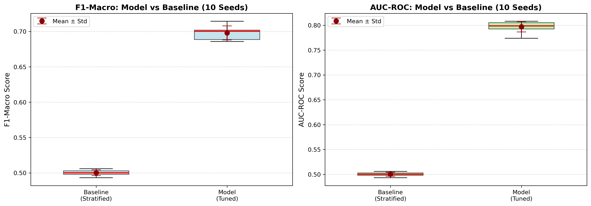
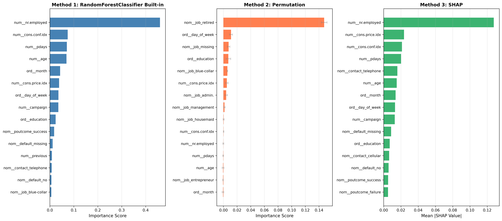

# Bank Term Deposit Subscription Prediction

Predicting whether a client will subscribe to a term deposit using leakage-aware preprocessing, class-balanced machine learning, and model interpretation.


## Overview

Direct-marketing campaigns are expensive when calls are made without a reliable way to prioritize likely customers. This project uses the UCI Bank Marketing dataset to predict whether a client will subscribe to a term deposit (`yes` or `no`) before the outcome of the call is known.

The workflow compares five classifiers, protects the held-out test set during model selection, handles severe class imbalance, and uses SHAP and permutation importance to explain the final Random Forest model.

### Project highlights

- Builds a realistic pre-call model by removing call `duration`, which would leak information unavailable before the call.
- Uses stratified train, validation, and test splits to preserve the approximately 11% positive-class rate.
- Compares Logistic Regression, SVM, KNN, Random Forest, and XGBoost.
- Selects models using macro F1, giving both classes equal importance.
- Evaluates stability across 10 random train/test splits.
- Explains global and individual predictions with impurity importance, permutation importance, and SHAP.

## Repository structure

```text
.
|-- 1030 Project.ipynb             # Modeling, tuning, evaluation, and interpretation
|-- eda.ipynb                      # Exploratory data analysis
|-- Data/
|   |-- bank-additional/
|   |   |-- bank-additional-full.csv   # Primary dataset used by the notebooks
|   |   |-- bank-additional.csv        # 10% sample supplied by UCI
|   |   `-- bank-additional-names.txt  # Dataset documentation and citation
|   `-- bank/
|       |-- bank-full.csv              # Alternate dataset variant; not used in modeling
|       |-- bank.csv
|       `-- bank-names.txt
|-- presentation_plots/            # EDA, evaluation, and SHAP figures
|-- Presentation.pdf               # Preliminary presentation
|-- final presentation.pdf         # Final project presentation
`-- README.md
```

## Dataset

The analysis uses `Data/bank-additional/bank-additional-full.csv`, the version of the Bank Marketing dataset that includes social and economic context variables.

| Property | Value |
|---|---:|
| Observations | 41,188 |
| Input variables | 20 |
| Target | `y` |
| Positive class (`yes`) | 4,640 (11.27%) |
| Negative class (`no`) | 36,548 (88.73%) |
| Time period | May 2008 to November 2010 |
| Missing-value marker | `unknown` in categorical fields |

The target asks whether the client subscribed to a term deposit after a Portuguese bank's direct-marketing campaign.

### Feature groups

- **Client profile:** age, job, marital status, education, credit default, housing loan, and personal loan.
- **Current campaign:** contact channel, month, day of week, contact count, and call duration.
- **Previous campaign:** days since previous contact, previous contact count, and previous outcome.
- **Economic context:** employment variation rate, consumer price index, consumer confidence index, Euribor rate, and number of employees.

### Important data note

`bank-full.csv` is a related UCI dataset with 45,211 rows and a different 17-column schema. The notebooks and reported results use `bank-additional-full.csv` with 41,188 rows and 21 columns including the target. Substituting the alternate file will break the feature pipeline and will not reproduce the reported results.

## Methodology

### 1. Leakage-aware cleaning

The notebook applies the following steps before model fitting:

1. Drops `duration`. Call duration is only known after a call is completed and strongly reveals the outcome, so using it would make a pre-call model unrealistic.
2. Replaces categorical `unknown` values with `NaN`.
3. Maps the target from `no`/`yes` to `0`/`1`.
4. Drops `emp.var.rate` and `euribor3m` after finding correlations above 0.90 among the economic indicators. `nr.employed` is retained as the strongest of the three relative to the target.

The raw modeled dataset contains 12 duplicated rows. The current notebook retains them, matching the reported results.

### 2. Preprocessing pipeline

All transformations are contained in a scikit-learn `ColumnTransformer` so they are learned from training data only.

| Feature type | Processing |
|---|---|
| Numerical | `StandardScaler` |
| Ordinal | Most-frequent imputation, then `OrdinalEncoder` |
| Nominal | Constant-value imputation, then `OneHotEncoder` |

After feature removal, 17 input columns are transformed into 40 model-ready features.

### 3. Data split and validation

The project uses a stratified 80/20 train/test split:

- Training and validation pool: 32,950 observations
- Held-out test set: 8,238 observations
- Inner training set: 26,360 observations
- Validation set: 6,590 observations
- Hyperparameter-tuning sample: 4,000 stratified observations

Hyperparameters are tuned with five-fold `StratifiedKFold` cross-validation. Models are ranked by validation macro F1, while the held-out test set remains untouched until final evaluation.

### 4. Models

The following models are evaluated:

- Logistic Regression with L1/L2 regularization and balanced class weights
- RBF Support Vector Machine with balanced class weights
- K-Nearest Neighbors
- Random Forest with balanced class weights
- XGBoost with positive-class weighting and early stopping

## Results

### Model comparison

| Model | Tuning CV F1-macro | Validation F1-macro |
|---|---:|---:|
| Random Forest | 0.6815 +/- 0.0296 | **0.7101** |
| XGBoost | 0.6784 +/- 0.0205 | 0.7022 |
| KNN | 0.6421 +/- 0.0451 | 0.6487 |
| Logistic Regression | 0.6222 +/- 0.0201 | 0.6316 |
| SVM | 0.6566 +/- 0.0340 | 0.5857 |

Random Forest achieved the strongest validation score and was selected as the champion model.

### Champion model

```python
RandomForestClassifier(
    n_estimators=100,
    max_depth=15,
    max_features="log2",
    min_samples_split=20,
    class_weight="balanced",
    random_state=42,
)
```

On the untouched test set, the selected model achieved:

| Metric | Score |
|---|---:|
| Test F1-macro | **0.7182** |
| Accuracy | 0.87 |
| Positive-class precision | 0.44 |
| Positive-class recall | 0.61 |
| Positive-class F1 | 0.51 |

The model favors useful minority-class recall over raw accuracy. That tradeoff is appropriate for campaign targeting, where missing likely subscribers can be costly and the target class is rare.

### Robustness across 10 random seeds

| Metric | Random Forest | Stratified dummy baseline |
|---|---:|---:|
| F1-macro, mean +/- SD | **0.7080 +/- 0.0060** | 0.5010 +/- 0.0033 |
| AUC-ROC, mean +/- SD | **0.7989 +/- 0.0073** | 0.5010 +/- 0.0033 |

Across these splits, Random Forest improved macro F1 by 0.2070 (41.3%) and AUC-ROC by 0.2980 (59.5%) relative to the dummy baseline.



## Interpretation

The feature-importance methods do not agree perfectly, which is expected because they measure different concepts. Taken together, they show several recurring patterns:

- `nr.employed` is the strongest global predictor in the impurity-based and SHAP analyses.
- Lower employment levels are associated with a higher predicted subscription probability.
- Contact channel and campaign timing contribute meaningfully to predictions.
- Previous campaign success is a useful positive signal.
- Repeated contacts during the current campaign can push predictions downward.
- Job category, especially retired clients, is influential under permutation importance.

These are predictive associations, not causal effects. They should guide targeting hypotheses and further experiments rather than be interpreted as proof that changing a feature will change subscription behavior.



## Getting started

### Prerequisites

- Python 3.9 or newer
- Jupyter Notebook or JupyterLab

### Installation

```bash
git clone https://github.com/Judyluo1217/Bank-Term-Deposit-Subscription-Prediction.git
cd Bank-Term-Deposit-Subscription-Prediction

python3 -m venv .venv
source .venv/bin/activate
python -m pip install --upgrade pip
python -m pip install jupyter pandas numpy matplotlib seaborn scikit-learn xgboost shap scipy
```

On Windows, activate the environment with:

```powershell
.venv\Scripts\activate
```

### Run the analysis

```bash
jupyter lab
```

Run the notebooks in this order:

1. `eda.ipynb` for exploratory analysis.
2. `1030 Project.ipynb` for preprocessing, model selection, test evaluation, robustness checks, and interpretation.

The modeling notebook performs an extensive grid search. Runtime depends on available CPU cores; the SVM and XGBoost searches are the slowest stages.

### Data-path note

The notebooks currently load the data with a path that assumes the repository directory is named `Bank-Term-Deposit-Subscription-Prediction`:

```python
../Bank-Term-Deposit-Subscription-Prediction/Data/bank-additional/bank-additional-full.csv
```

If the repository was cloned under a different name or the notebook is launched from another working directory, replace that path with:

```python
Data/bank-additional/bank-additional-full.csv
```

## Reproducibility

To reproduce the reported results:

1. Use `bank-additional-full.csv`, not `bank-full.csv`.
2. Keep `random_state=42` for the main split and tuning workflow.
3. Run notebook cells from top to bottom in a fresh kernel.
4. Keep the held-out test set untouched until the model has been selected using validation F1-macro.
5. Expect small differences across package versions or random seeds, especially in tree-based models and SHAP outputs.

## Limitations

- The data comes from one Portuguese bank and a historical period, so performance may not transfer directly to another market or current customer population.
- Class imbalance remains substantial; positive-class precision is modest even after class weighting.
- The robustness analysis varies train/test seeds but does not replace temporal or external validation.
- Some variables describe prior contacts or macroeconomic context and may shift over time.
- The default 0.50 decision threshold is not optimized for a specific campaign cost or contact capacity.

## Future work

- Tune the classification threshold around campaign capacity and false-positive cost.
- Add interaction features and compare calibrated probability models.
- Evaluate temporal validation to better simulate deployment on future campaigns.
- Add richer customer-demographic and behavioral features where legally and ethically appropriate.
- Build a dashboard that combines predicted probability, explanation, and campaign prioritization.

## Presentation

The [final presentation](./final%20presentation.pdf) summarizes the modeling approach, model comparison, uncertainty analysis, and interpretation. The [preliminary presentation](./Presentation.pdf) focuses on EDA and preprocessing decisions.

## Citation

The dataset is publicly available through the [UCI Machine Learning Repository](https://archive.ics.uci.edu/ml/datasets/Bank+Marketing). Please cite the original study when using the data:

> Moro, S., Cortez, P., & Rita, P. (2014). A data-driven approach to predict the success of bank telemarketing. *Decision Support Systems, 62*, 22-31. https://doi.org/10.1016/j.dss.2014.03.001

## Author

**Yuhan Luo**  
Brown University  
[GitHub](https://github.com/Judyluo1217)
